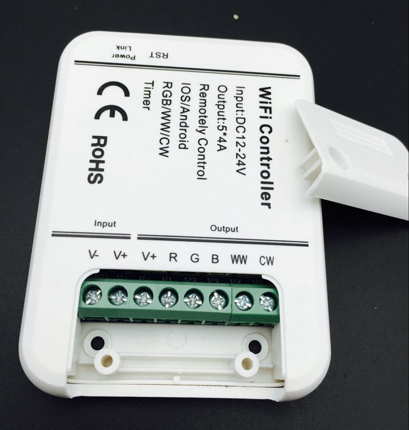

# MagicHomeLed Binding

This is binding for MagicHome WiFi led controller like on the picture 


This controller connect to WiFi and uses proprietary protocol, that have been reverse-engineered by me in [JMagicHome project](https://github.com/tfedyanin/MagicHome-WifiLedController.git).

## Supported Things

Supported only one thing - `magichomeled311`. As opposed to a physical device that has 5 independent channels for light, on/off switch and different light programs, this thing only has on/off switch and 3 channels: warn and cold white and convenient RGB channel, that combine another 3 physical channels.

## Thing Configuration
There is simple example configuration in [cfg](cfg/things/demo.things) directory.

```
# Configuration for the MagicHomeLed Binding
#
# This option enable discovery of all devices in current networks.
discovery=true

# This address uses for sending discovery broadcast packets. By default uses address below:
broadcastAddress=192.168.1.255

# MAC of wifi led device. You can find it in iOs or Android application or in debug log of current binding with enabled discovery.
mac=ACCF23BC1AA4

# Host used with disabled discovery or in cases, when discovery didn't find device with given mac. This valus can be empty.
host=
```
Example of configuring thing:
```
Thing magichomeled:magichomeled311:bedfar [discovery=true, mac="ACCF23BC1AA4"]
```


## Channels
There is 4 channels:
* power - turn on/off device
* cold-white - percent of power of cw channel
* warn-white - percent of power of ww channel
* color - HSB for another 3 (RGB) channels

## Full Example

Full example you can find in [cfg](cfg/) directory.
